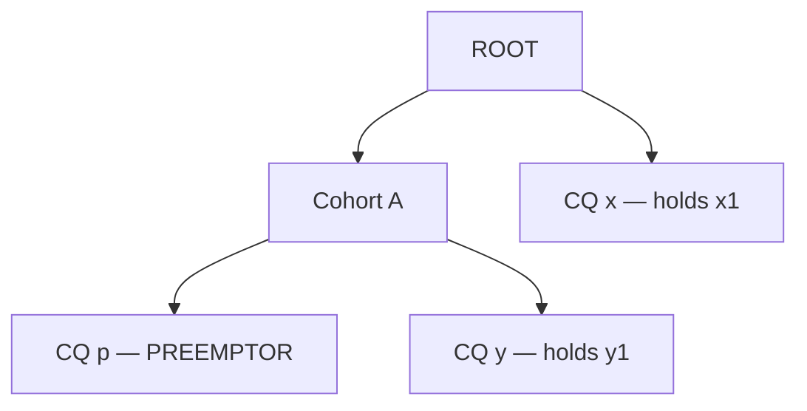

# Fair Sharing Preemption Loop Analysis (#14543)

This document diagnoses the fair sharing preemption loop in [issue #14543](https://github.com/kubernetes-sigs/kueue/issues/14543). It describes five candidate algorithms that prevent unfair cross-queue evictions and compares their trade-offs. The appendices describe the evaluation methodology and test suites (Appendix A), the detailed correctness and performance evaluation per algorithm (Appendix B), and a summary of the trade-off results (Appendix C).

---

## Problem Statement

### Bug Overview

In fair sharing preemption, an incoming workload can start an infinite preemption loop between two `ClusterQueue` (`CQ`) instances:

1. An incoming workload in `PREEMPTOR_CQ` evicts an **intra-CQ** workload (from the same queue). This lowers `PREEMPTOR_DRS` and unlocks a **cross-CQ** victim (from another queue).
2. The evicted intra-CQ workload returns to `PREEMPTOR_CQ`. It returns either immediately during `fillBackWorkloads`, or in the next scheduling cycle into the freed capacity.
3. `PREEMPTOR_CQ` returns to its higher **Dominant Resource Share (DRS)**. Then the evicted cross-CQ workload preempts the incoming workload back, and the cycle repeats.

#### Counter-Example (`CohortCapacity = 100 CPU`)

A cohort has `100 CPU` of total capacity and two queues (`QP` and `QT`). The cohort owns the `100 CPU`. Both queues have `nominalQuota = 0` and a fair sharing weight of 1, so all their usage is borrowed. As a result, the DRS of each queue is its usage divided by `100 CPU` (Kueue scales this value by 1000). The strategies are the default `[LessThanOrEqualToFinalShare, LessThanInitialShare]`:

| Queue | Admitted Workloads | Incoming Workload | Total Requested Usage |
| :--- | :--- | :--- | :--- |
| `QP` (Preemptor) | `P_small = 30 CPU` | `P_hero = 60 CPU` | `90 CPU` (`DRS = 0.90`) |
| `QT` (Target) | `T_hero = 70 CPU` | — | `70 CPU` (`DRS = 0.70`) |

When `P_hero` (`60 CPU`) arrives in `QP`, the preemption cycle occurs as follows:

1. **Candidate selection:** With `P_hero` included, `QP` requests `90 CPU` (`DRS = 0.90`). As a result, `QP` cannot preempt `T_hero` (`DRS = 0.70`). Instead, `QP` first evicts `P_small` (`30 CPU`), which lowers the DRS of `QP` to `0.60`. On the retry pass, `0.60 < 0.70` (`LessThanInitialShare`), so `QP` also selects `T_hero` (`70 CPU`) for eviction.
2. **Immediate cycle (current `fillBackWorkloads` behavior):** The eviction of `T_hero` freed `70 CPU`, so `fillBackWorkloads` restores `P_small` (`30 CPU`). `QP` admits `P_hero` together with `P_small` (`30 + 60 = 90 CPU`, `DRS = 0.90`). In the next cycle, `T_hero` (`0.70 < 0.90`) preempts `P_hero`.
3. **Delayed cycle (even if `fillBackWorkloads` blocks `P_small`):** Assume that a stricter `canFillBack` check prevents `fillBackWorkloads` from restoring `P_small`:
   - The scheduler evicts both `P_small` (`30 CPU`) and `T_hero` (`70 CPU`) and admits `P_hero` (`60 CPU`). The DRS of `QP` becomes `0.60`.
   - `40 CPU` of cohort capacity stay idle. `T_hero` (`70 CPU`) does not fit in `40 CPU`. It cannot preempt `P_hero` because `0.70 > 0.60`.
   - In the next scheduling cycle, the scheduler admits `P_small` (`30 CPU`) into the `40 CPU` of idle capacity. This raises `QP` back to `90 CPU` (`DRS = 0.90`).
   - `T_hero` now preempts `P_hero` (`0.70 < 0.90`), and the cycle repeats.

### Root Cause and Fair Sharing Proof Consideration

The bug starts in the two-pass candidate selection algorithm in [`pkg/scheduler/preemption/preemption.go`](https://github.com/kubernetes-sigs/kueue/blob/e0e3c3cf0727f76d95b8f31288cd8eab6cd7658a/pkg/scheduler/preemption/preemption.go#L533-L580) (governed upstream by the `FairSharingReevaluatePreemptionCandidates` feature gate):

1. **Pass 1 (Initial forward pass):** The preemptor cannot evict a cross-CQ candidate because `PREEMPTOR_DRS > TARGET_DRS`. Instead, the algorithm marks intra-CQ workloads for eviction. This decreases `PREEMPTOR_DRS`.
2. **Pass 2 (Re-evaluation pass):** The algorithm retries the cross-CQ candidate that it skipped before. The check `(PREEMPTOR_DRS - REMOVED_INTRA_CQ_SHARE) < TARGET_DRS` now passes.
3. **Fill-back or re-admission:** Either [`fillBackWorkloads`](https://github.com/kubernetes-sigs/kueue/blob/e0e3c3cf0727f76d95b8f31288cd8eab6cd7658a/pkg/scheduler/preemption/preemption.go#L340-L351) or the next scheduling cycle restores the evicted intra-CQ workload into the freed quota.

**Preemption-Based Fair Sharing Proof Consideration:** The [Proof That Two Workloads Will Not Preempt Each Other](https://kueue.sigs.k8s.io/docs/concepts/fair_sharing/#proof-that-two-workloads-wont-preempt-each-other) requires that the post-admission share of the preemptor queue (`DRS_A_admitted`) stays constant during the cross-CQ evaluation. Intra-CQ evictions reduce `PREEMPTOR_DRS` during the search. When those intra-CQ workloads return, `DRS_A_admitted` is different before and after preemption. This breaks the cycle-freedom invariant.

---

## Solutions at a Glance

1. **Fast Path Post-Check:** The scheduler runs the current search without changes. After `fillBackWorkloads`, it checks that each cross-CQ target is still fair in the final state. If one target fails, the scheduler refuses the preemption.
2. **Share Locking:** The scheduler freezes `PREEMPTOR_DRS` at its value before the search. Intra-CQ evictions still free capacity, but they cannot lower the share that cross-CQ checks use.
3. **Fast Path + Locking:** The scheduler runs Solution 1 first. If the post-check fails, it runs Solution 2 as a second pass.
4. **Iterative Offender Pruning:** The scheduler runs Solution 1. If a cross-CQ target fails the post-check, the scheduler removes that target from the candidates and searches again, up to a fixed number of passes.
5. **Level-Locked Search (AI-generated, not a proposal):** The scheduler tries 0, 1, 2, … evictions of its own workloads. At each level, it locks `PREEMPTOR_DRS` and searches only cross-CQ candidates. It returns the first target set that is fair in the final state.

The section [Possible Solutions](#possible-solutions) describes each solution in detail.

---

## Trade-Off Summary

The table below compares the five solutions. Appendices A and B provide the methodology and detailed evaluation per algorithm.

| Property | 1. Fast Path Post-Check | 2. Share Locking | 3. Fast Path + Locking | 4. Iterative Offender Pruning | 5. Level-Locked Search |
| :--- | :---: | :---: | :---: | :---: | :---: |
| **Fixes #14543 without unfair loops** ¹ | Yes | Yes ² | Yes | Yes | Yes |
| **Intra-CQ evictions can lower `PREEMPTOR_DRS` for cross-CQ checks** ³ | Yes | No | Yes | Yes | Yes |
| **Solved random scenarios** ⁴ | 98.37% | 96.68% | 98.58% | 98.82% | 98.89% |
| **Case types that it refuses** ⁵ | Own-only, mixed, alternative set | Own-deflation, mixed, alternative set, stale victim share | Mixed, alternative set | None of the case types | None of the case types |
| **Worst case, compared with upstream** | 1.04× | 2.5× | 2.6× (#14543 trigger, refuses) | 5.1× (≥ 8 trap queues) | 14.6× (16 own candidates, no fixed limit) |

¹ No solution adds an unfair loop. In the rare cases where a loop occurs, each step is individually fair (for example, a fair cross-queue eviction followed by internal priority preemption).

² Share Locking does not check the final state, so it keeps an upstream fault with stale target shares. This fault causes 8 counter-preemptions in the random tests and 10 loops in the simulator.

³ All solutions can evict intra-CQ workloads to free capacity. In Share Locking, these evictions do not decrease the locked `PREEMPTOR_DRS`. Later cross-CQ checks still use the locked value.

⁴ The tests generate 4,576 small random scenarios, similar to fuzz tests. For each scenario, a brute-force checker tries every possible set of victims and marks the valid sets. The value is the percentage of scenarios with at least one valid set for which the solution returns a valid set. 2,892 of the 4,576 scenarios have at least one valid set. A refusal is safe: the workload stays pending and nothing is evicted. For comparison, upstream solves 98.61%, but it also makes 49 unfair evictions. These do not count as solved.

⁵ Case types:

- **Own-only:** The only fair answer evicts only own workloads of the preemptor.
- **Own-deflation:** Own workloads of the preemptor must stay evicted. Their eviction lowers the share of the preemptor and makes a cross-CQ eviction fair.
- **Mixed:** One own workload must stay evicted, and another own workload returns during fill-back.
- **Alternative set:** The first set that the search finds is unfair, but a different fair set exists.
- **Stale victim share:** A workload from the victim CQ returns during fill-back, so the victim share that the search used is out of date.

Solutions 4 and 5 pass all case types, but they still miss 34 and 32 random scenarios.

---

## Possible Solutions

### 1. Fast Path Post-Check

This solution keeps the current search and adds one check at the end. After `fillBackWorkloads`, the scheduler checks that each cross-CQ target is still fair in the final state.

#### Pseudo Code

```text
// Select candidates for preemption (current search)
targets <- SELECT PREEMPTION CANDIDATES

// Restore non-essential evicted workloads
targets <- fillBackWorkloads(targets)

// New step: check each cross-CQ target in the final state
if findUnfairTarget(targets) is None:
  return targets
return [] // Refuse the incoming workload
```

`findUnfairTarget` uses the final state `F`: the admitted workloads, minus the targets, plus the incoming workload. For each cross-CQ target `t`, it runs the configured strategy at the `almostLCA` with these shares:

- Preemptor share: `DRS(F)`.
- Old target share: `DRS(F + t)`.
- New target share: `DRS(F)`.

It returns the first target that fails, or `None`. Solutions 3, 4, and 5 use the same check.

#### Observations and Limitations

- **Why it works:** The check refuses each target set that is not fair after fill-back. This prevents `#14543` preemption loops.
- **All or nothing:** If the search selects one unfair cross-CQ target, the full preemption fails (`return []`). This occurs even when a fair set exists in other queues.
- **No retry:** The algorithm cannot remove the unfair target and search again.
- **Test results:** It fixes `#14543` (0 violations). It solves 98.37% of the solvable random scenarios. It refuses all 186 own-only cases and 39 of the 40 mixed cases. In the normal case, its cost is the same as upstream.

---

### 2. Share Locking

The locking approach freezes `PREEMPTOR_DRS` at its post-admission value during cross-CQ comparisons. This value is the DRS of `PREEMPTOR_CQ` with the usage of the incoming workload added. The scheduler can still evict intra-CQ candidates to free capacity, but their removal does not decrease `PREEMPTOR_DRS`. `PREEMPTOR_DRS` never decreases during the search. As a result, intra-CQ evictions cannot unlock unfair cross-CQ victims.

#### Pseudo Code

```text
// Lock preemptor DRS at its current usage plus the incoming workload
LOCKED_PREEMPTOR_DRS <- DRS(PREEMPTOR_CQ usage + INCOMING_WORKLOAD request)

targets <- []
for candidate in candidates:
  if candidate is INTRA_CQ:
    // Evict for capacity, but keep LOCKED_PREEMPTOR_DRS unchanged
    REMOVE candidate FROM SNAPSHOT
    APPEND candidate TO targets
  else if candidate passes strategy using LOCKED_PREEMPTOR_DRS:
    REMOVE candidate FROM SNAPSHOT
    APPEND candidate TO targets

  if WORKLOAD_FITS:
    targets <- fillBackWorkloads(targets)
    return targets

// Deny incoming workload admission
return []
```

#### Observations and Limitations

- **Why it works:** The share of the preemptor cannot decrease during the search. This keeps the constant-share rule of the fair sharing proof. In the counter-example (`CohortCapacity = 100`), the locked DRS of `QP` stays at `0.90 > 0.70`. This prevents `P_hero` from preempting `T_hero`.
- **Ignores valid intra-CQ deflation:** Locking still evicts intra-CQ workloads. Sometimes such a workload must stay evicted in the final state, so the real share of the preemptor is lower. But the eviction does not decrease the locked `PREEMPTOR_DRS`, and later cross-CQ checks still use the locked value. As a result, the scheduler misses valid cross-CQ evictions that depend on this lower share.
- **Nested cohorts:** The share of each parent cohort is frozen too. A valid eviction from a sibling CQ cannot lower the share of the parent cohort. As a result, this eviction cannot unlock victims in other cohorts.
- **Test results:** It fixes `#14543` (0 violations). It does not check the final state, so it keeps an upstream fault with stale target shares. In the random tests, this fault causes 22 unfair evictions and 8 counter-preemptions. In the simulator, it causes 169 unfair steps and 10 loops. It refuses all 734 own-deflation cases and solves the fewest random scenarios (96.68%). In the normal case, its cost is the same as upstream. On the `#14543` trigger, its cost is 2.5× upstream.

#### Hierarchical Cohort Extension

In a single-cohort setup, it is sufficient to lock only the DRS of the preemptor `ClusterQueue`. In a multi-cohort hierarchy, a lock at the `ClusterQueue` level alone still allows a cross-cohort preemption cycle:



If only the DRS of `CQ p` is locked, the same preemption loop can occur across cohorts:

1. `CQ p` first evicts `y1` from the sibling `CQ y` inside `Cohort A`.
2. The eviction of `y1` lowers the DRS of `Cohort A`. This unlocks `x1` in `CQ x` on the retry pass.
3. `fillBackWorkloads` (or the next scheduling cycle) restores `y1` into `CQ y`. This increases the DRS of `Cohort A` again, and `x1` preempts the workload of `CQ p` in return.

To prevent cross-cohort cycles, the algorithm records a locked initial DRS for each node on the ancestor path of the preemptor. For each target, the algorithm reads the locked DRS at the `almostLCA` of the preemptor (the child of the Least Common Ancestor):

- When `CQ p` evaluates `y1` in `CQ y`, the `almostLCA` of the preemptor is `CQ p`. The check uses the locked DRS of `CQ p`.
- When `CQ p` evaluates `x1` in `CQ x`, the `almostLCA` of the preemptor is `Cohort A`. The check uses the locked DRS of `Cohort A`, which the eviction of `y1` does not change.

---

### 3. Fast Path Post-Check with Locking Fallback

This solution tries **Solution 1 (Fast Path Post-Check)** first. If that search finds a valid set of targets, preemption succeeds immediately. If the check fails, the scheduler falls back to **Solution 2 (Share Locking)** and searches a second time. If both searches fail, it refuses admission.

#### Pseudo Code

```text
// Pass 1: Run Solution 1 (standard search, fill-back, final fairness check)
targets <- FAST_PATH_SEARCH(candidates)
if targets is not empty:
  return targets

// Pass 2: Run Solution 2 (search with locked share, fill-back, final fairness check)
targets <- fillBackWorkloads(LOCKED_SEARCH(candidates))
if targets is not empty and findUnfairTarget(targets) is None:
  return targets

// Refuse admission if both passes fail
return []
```

#### Observations and Limitations

- **Combines the strengths of Solutions 1 and 2:** Pass 1 allows own workloads to lower the preemptor's share and unlock fair cross-queue victims. If Pass 1 picks an invalid victim that fails the final check, Pass 2 tries again with a locked share.
- **Still fails on mixed cases:** Consider a queue with two own workloads: a large one (`p1`) that must stay evicted, and a small one (`p2`) that fills back. Pass 1 fails because `p2` returns and makes the cross-queue victim unfair. Pass 2 also fails because its locked share cannot see that `p1` lowers the preemptor's share.
- **No stale-share bugs:** Both passes check the final state. This avoids the stale-share bug present in Solution 2.
- **Double search cost on refusal:** When admission is refused, the scheduler must run two full preemption searches.
- **Test results:** It fixes `#14543` (0 violations) and adds no unfair loops. It solves 98.58% of solvable random scenarios. It solves all own-only and own-deflation cases, but only 1 of the 40 mixed cases. Refusal latency is 1.7× to 1.9× upstream on normal refusals, and 2.6× on the `#14543` trigger.

---

### 4. Iterative Offender Pruning

This solution builds on Solution 1. Instead of giving up when the final check fails, it removes the bad victim and searches again.

1. **Pass 1:** Run the normal search, run `fillBackWorkloads`, and check the final state (identical to **Solution 1**). If all targets are fair, return them immediately.
2. **Handle failures:** If a target from another queue fails the fairness check, mark it as an **offender**.
3. **Retry:** Permanently remove the offender from the candidate list and search again.
4. **Repeat:** Repeat this process up to `MAX_PASSES` times (for example, 8 passes). If it still cannot find a fair set of victims, it refuses admission.

#### Pseudo Code

```text
candidates <- ALL LEGAL PREEMPTION CANDIDATES

for iteration from 1 to MAX_PASSES:
  // Standard candidate search
  targets <- SELECT PREEMPTION CANDIDATES(candidates)

  if not WORKLOAD_FITS:
    return [] // Not enough resources

  // Restore non-essential workloads
  targets <- fillBackWorkloads(targets)

  // Check fairness in the final state
  offender <- findUnfairTarget(targets)

  if offender is None:
    return targets // All targets are fair

  // Remove the unfair target and try again
  candidates <- REMOVE offender FROM candidates

// Refuse admission if max passes exceeded
return []
```

#### Observations and Limitations

- **Finds alternative victims:** In Solution 1, a single bad victim causes the entire preemption to fail. Solution 4 drops that bad victim and keeps looking for other fair victims in the cluster.
- **Supports real share drops:** When the preemptor's own workloads stay evicted, the final check uses the lower, real share. This avoids the main drawback of Share Locking.
- **Removes offenders one by one:** Each pass removes only one offender. During search, evicting an own workload temporarily lowers the preemptor's share. This can make several cross-queue candidates look fair. After fill-back restores the own workload, each of those candidates will fail the check. The scheduler must run a new pass for each one. If there are more offenders than `MAX_PASSES`, preemption fails.
- **Fast share recalculation:** Checking the final state changes only one queue usage in the snapshot, so recalculating shares after fill-back adds almost no overhead.
- **Test results:** It fixes `#14543` (0 violations) and adds no unfair loops. It solves 98.82% of solvable random scenarios and passes all 40 mixed cases. With 8 or more trap queues, it runs all 8 passes (costing 5.1× upstream) before safely refusing.

---

### 5. Level-Locked Search with Local Pruning (`v3.1` — AI-Generated, Reference Only)

> **Disclaimer:** This solution is not a proposal. An AI model (Claude Opus) proposed this approach as an experiment based on Solution 4. AI agents ran all of its tests. The author did not design or validate this code or its test results. It is included only for reference as an alternative direction, not as a recommended fix.
>
> **Overfitting risk:** This approach was tuned to pass specific test cases. It is a set of heuristics added to Solution 4, not a formal algorithmic model.

Level-Locked Search steps through the number of own workloads to evict. It does not permanently remove candidates across all passes:

1. **Fast path:** Run a standard candidate search, run `fillBackWorkloads`, and check the final state. If all targets are fair, return them immediately (same as Solution 1).
2. **Slow path (level search):** Split candidates into `own` (from the preemptor's queue) and `cross` (from other queues). Step through each level $k = 0 \dots \text{len}(own)$, where $k$ is the number of own workloads to evict first.
3. **Search at level $k$:**
   - Evict the first $k$ own workloads (`own[:k]`).
   - Lock the preemptor's share at this snapshot.
   - Search only among `cross` candidates. Because the preemptor's share is locked, any queue with a lower share is skipped immediately during candidate selection.
4. **Validate and prune locally at level $k$:** Run `fillBackWorkloads` and check the remaining targets:
   - **All targets fair:** Preemption succeeds. Return `targets`.
   - **Check fails, and an own workload filled back:** A cross-queue victim was too large and freed extra capacity, allowing an `own[:k]` workload to return. Drop the last selected cross target from this level and retry level $k$.
   - **Check fails, but own workloads stayed evicted:** Drop the unfair cross target (`offender`) from this level and retry level $k$.
   - **Advancing to level $k+1$:** When advancing to the next level, restore all cross candidates so they can be re-evaluated with the new, lower share.

#### Pseudo Code

```text
candidates <- ALL LEGAL PREEMPTION CANDIDATES

// Fast path: standard search + final-state validation
targets <- SELECT PREEMPTION CANDIDATES(candidates)
if not WORKLOAD_FITS:
  return []
targets <- fillBackWorkloads(targets)
if findUnfairTarget(targets) is None:
  return targets

// Slow path: split into own and cross candidates
own, cross <- SPLIT_BY_CQ(candidates, PREEMPTOR_CQ)

for k from 0 to len(own):
  levelCross <- COPY(cross) // Restore all cross candidates at each level k

  while True:
    // Evict the first k own workloads and lock the preemptor share
    REMOVE own[:k] FROM SNAPSHOT
    LOCK PREEMPTOR_CQ DRS AT CURRENT SNAPSHOT

    crossTargets <- SELECT PREEMPTION CANDIDATES(levelCross)
    targets <- own[:k] + crossTargets
    if not WORKLOAD_FITS:
      break // Move to level k + 1

    targets <- fillBackWorkloads(targets)
    offender <- findUnfairTarget(targets)
    if offender is None:
      return targets // Found a valid set of targets

    // Local pruning within level k
    if NOT ALL own[:k] KEPT IN targets:
      // An own workload filled back -> drop the last cross target
      levelCross <- REMOVE last(crossTargets) FROM levelCross
    else:
      // Own workloads stayed evicted -> drop the unfair offender
      levelCross <- REMOVE offender FROM levelCross

return []
```

#### Observations and Limitations

- **Restores candidates across levels:** Removals apply only within level $k$. When advancing to level $k+1$, the preemptor has a lower share, so cross-queue targets that were unfair at level $k$ can become fair and are re-tested.
- **Skips unfair queues in bulk:** Locking the share during level $k$ candidate selection filters out entire queues that have lower shares in a single pass, rather than discovering them one by one.
- **Heuristic limitations:** The algorithm evicts own workloads in a fixed order (lowest priority first). It can miss valid solutions that require evicting workloads in a different order.
- **Hierarchies:** In nested cohorts, the algorithm locks shares along the entire ancestor path. Evicting workloads from a sibling queue inside the same parent cohort will not lower the parent cohort's locked share.
- **Unbounded worst-case cost:** In bad scenarios with many own candidates (such as 16 own workloads) and no fair solution, exploring every level can take up to 14.6× longer than upstream.

---

## Appendix A: Evaluation Methodology & Test Suites

> **Disclaimer:** AI agents wrote the test code, ran the evaluation suites, and collected the benchmark metrics. The author reviewed the test design, results, and failure analyses. Use the results to compare coverage and scaling characteristics across candidate algorithms.

Each test executes the candidate algorithm's preemption logic (`Preemptor.GetTargets`) on synthetic cluster snapshots specifying cohorts, `ClusterQueues`, admitted workloads, and one incoming workload.

### A.1 Correctness Test Sets

- **Random Fuzzing Tests (4,576 scenarios):** Randomly generated cluster topologies with 1 to 12 evictable workloads. Each scenario is verified against a brute-force oracle that tests all possible victim subsets to determine whether a valid, cycle-free solution exists (2,892 scenarios have at least one valid set). A solution is valid if:
  - The incoming workload fits and the victim set is minimal.
  - Every cross-CQ eviction is fair with respect to the preemptor's final share (preventing #14543 loops).
  - No evicted workload can counter-preempt the incoming workload upon re-queuing.
  - *Pass:* The algorithm returns a valid set.
  - *Safe Refusal (Miss):* A valid set exists, but the algorithm returns nothing; the incoming workload remains pending without evicting any workloads.
  - *Bug:* The algorithm returns an invalid set (unfair eviction or counter-preemption).
- **Targeted Edge-Case Suites:** Handcrafted scenarios testing specific fair-sharing preemption dynamics:
  - **Own-only (186 scenarios):** Preemption can be satisfied entirely by evicting workloads from the preemptor's own queue. Validates that cross-CQ workloads are not needlessly or unfairly evicted.
  - **Own-deflation (734 scenarios):** Preemptor intra-CQ workloads must remain evicted, lowering the preemptor's DRS and legitimately permitting a cross-CQ eviction.
  - **Mixed (40 scenarios):** One intra-CQ workload must remain evicted while another returns during `fillBackWorkloads`.
  - **Alternative Set (10 scenarios):** The first candidate set encountered during search is unfair in the final state, but a different fair candidate set exists.
  - **Stale Victim Share (20 scenarios):** Workloads in a victim queue return during fill-back, altering the victim's DRS after initial evaluation (tested in single and nested cohorts).
  - **Hierarchy & Cycle-Only (164 scenarios):** Multi-level cohort trees testing share propagation, and guaranteed-cycle topologies where admission must be safely refused.
- **Multi-Cycle Simulator (15,645 scenarios):** End-to-end multi-cycle simulation running up to 50 consecutive scheduling cycles to detect whether admitted workloads trigger recurring or oscillating preemption loops.

### A.2 Performance Benchmark Setup

- **Cluster Scalability:** Evaluated on synthetic clusters with 100, 1,000, and 5,000 admitted workloads, as well as hierarchical topologies with 3 cohort levels and 60 `ClusterQueues`.
- **Preemption & Retry Stress:** Latency measured on normal admissions, quota-exhaustion refusals, #14543 trigger scenarios, adversarial "trap" queues (queues whose workloads appear eligible during candidate search but fail post-fillback validation), and large intra-CQ candidate pools (up to 16 own candidates).

---

## Appendix B: Evaluation by Algorithm

### B.1 Solution 1: Fast Path Post-Check

- **Correctness:**
  - **Loop freedom:** Completely eliminates #14543 preemption loops (0 violations in fuzzing, 0 unfair steps across 15,645 multi-cycle simulator runs).
  - **Test set behavior:** Solves 98.37% of solvable random scenarios (47 safe refusals). Passes Own-deflation (733/734), Stale victim share (18/20; 10/10 single cohort and 8/10 nested cohort), and Nested cohort tests (154/154).
  - **Safe refusals:** Refuses Own-only (0/186), Mixed (1/40), and Alternative set (0/10). Because it performs an all-or-nothing check after candidate search, selecting a single cross-CQ target that becomes unfair after fill-back causes the algorithm to safely abort preemption rather than searching for alternative candidates.
- **Performance:**
  - **Normal case:** Identical to upstream across all cluster sizes (100 to 5,000 workloads). The post-check complexity ($O(T \cdot H \cdot R)$) is unmeasurable at scale (≈ 20 µs at 10 workloads, undetectable at ≥ 100 workloads).
  - **Worst case / Retries:** 1.04× upstream on refusals. Because it performs no retries or backtracking, its worst-case execution time is strictly bounded to a single search pass and a single validation pass.

### B.2 Solution 2: Share Locking

- **Correctness:**
  - **Loop freedom:** Prevents the specific #14543 loop mechanism by freezing preemptor DRS. However, because it does not validate the final state, it retains upstream stale-share faults, resulting in 22 unfair evictions, 8 counter-preemptions in random tests, and 10 loops (169 unfair eviction steps) in the simulator.
  - **Test set behavior:** Solves the lowest percentage of random scenarios (96.68%; 92 safe misses plus 4 invalid outcomes out of 2,892 solvable cases). Successfully handles Own-only (186/186) and Cycle-only (10/10).
  - **Deflation blindness:** Refuses all 734 Own-deflation scenarios and all 40 Mixed scenarios. Freezing preemptor DRS prevents the algorithm from recognizing when intra-CQ evictions legitimately lower the preemptor's share to unlock valid cross-CQ victims.
- **Performance:**
  - **Normal case:** Matches upstream latency ($O(W + N \log N + S)$).
  - **Worst case:** 2.5× upstream latency on the #14543 trigger condition due to evaluating locked DRS bounds against candidate queues. Complexity is strictly single-pass ($O(H^2 \cdot R)$ overhead per candidate).

### B.3 Solution 3: Fast Path + Locking Fallback

- **Correctness:**
  - **Loop freedom:** Eliminates #14543 loops (0 violations, 0 unfair steps, 0 unfair simulator loops).
  - **Test set behavior:** Solves 98.58% of solvable random scenarios (41 safe misses). By falling back to locked search when post-check fails, it successfully resolves both Own-only (186/186) and Own-deflation (733/734).
  - **Limitations:** Fails on Mixed scenarios (refuses 39/40) and Alternative set (0/10). Pass 1 fails because an own workload fills back, while Pass 2 fails because share locking cannot account for legitimate share deflation.
- **Performance:**
  - **Normal case:** Identical to upstream when Pass 1 succeeds.
  - **Worst case / Retries:** When Pass 1 fails, Pass 2 runs a second complete search. Refusals cost 1.7× to 1.9× upstream latency on standard refusals, and 2.6× upstream on the #14543 trigger.

### B.4 Solution 4: Iterative Offender Pruning

- **Correctness:**
  - **Loop freedom:** Completely eliminates #14543 loops (0 violations, 0 unfair steps).
  - **Test set behavior:** Highest practical solve rate among proposed solutions (98.82% of solvable random scenarios, 34 safe misses). Passes all targeted case types: Own-only (186/186), Own-deflation (733/734, where the single miss is caused by non-deterministic Go map iteration order rather than an algorithmic flaw), Mixed (40/40), Alternative set (10/10), Stale victim share (20/20), and Nested cohorts (154/154).
  - **Mechanism:** When a cross-queue target fails post-fillback validation, the algorithm removes it permanently and retries up to `MAX_PASSES` (8) times. This allows the algorithm to bypass trap candidates and discover alternative fair sets.
- **Performance:**
  - **Normal case:** Identical to upstream on the first pass.
  - **Worst case / Retries:** Each retry pass requires a full candidate search (≈ 4.7 ms per pass at 1,000 workloads). In topologies with ≥ 8 trap queues, it executes up to 8 passes before refusing, reaching 5.14× upstream latency.

### B.5 Solution 5: Level-Locked Search (AI-Generated, Reference Only)

- **Correctness:**
  - **Loop freedom:** Eliminates #14543 loops (0 violations, 0 unfair steps).
  - **Test set behavior:** Solves 98.89% of random scenarios (32 safe misses) and passes all targeted case types.
- **Performance:**
  - **Normal case:** Identical to upstream on the fast path.
  - **Worst case / Retries:** Explores candidate levels without a fixed pass limit. In adversarial scenarios with many own candidates (16 own workloads) and no fair solution, worst-case latency scales up to 14.6× upstream (≈ 4.7 ms per candidate level).

---

## Appendix C: Summary of Trade-Offs and Findings

The evaluation highlights distinct trade-offs across correctness guarantees, edge-case coverage, and computational cost:

- **Single-Pass Validation vs. Multi-Pass Retries:**
  - **Solution 1 (Fast Path Post-Check)** eliminates preemption loops with virtually zero computational overhead (1.04× worst case) and minimal code complexity. Its main limitation is conservatism: when an initial victim choice becomes unfair after fill-back (such as in Mixed or Alternative set cases), it safely refuses preemption rather than searching for other viable victim sets.
  - **Solution 4 (Iterative Offender Pruning)** achieves complete coverage across all tested edge cases (including Mixed and Alternative sets) by dropping bad victims and retrying alternative combinations. Its trade-off is variable latency: under adversarial queue configurations with multiple trap candidates, it executes up to 8 search passes (5.1× worst-case latency).
- **Share-Locking Trade-Offs:**
  - Freezing the preemptor's share (**Solution 2**) prevents valid preemption when own workloads must stay evicted to lower the share (0/734 Own-deflation cases). Without final-state validation, it also allows stale victim share inaccuracies to persist.
  - Combining fast-path with locking fallback (**Solution 3**) recovers Own-deflation and Own-only scenarios under a final-state check, but doubles refusal latency (2.6×) without resolving Mixed fill-back cases.
- **Baseline Scalability:**
  - Across all candidate algorithms, normal-path preemption latency is indistinguishable from upstream Kueue. Performance differences only appear during preemption failures or when retrying edge cases.
